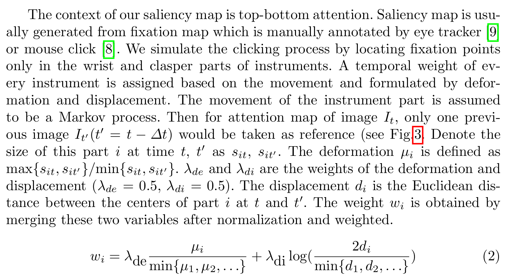
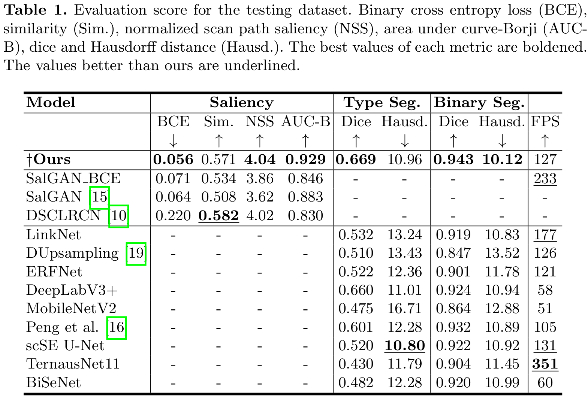

# Learning_WhereToLook
This repository is the implementation of the paper [Learning Where to Look While Tracking Instruments in Robot-assisted Surgery](https://link.springer.com/chapter/10.1007/978-3-030-32254-0_46). The paper is selected to present oral and poster both in [MICCAI 2019 conference](https://www.miccai2019.org/). 


### Dataset:
[MICCAI Surgical Instrument Segmentation Challenge 2017](https://endovissub2017-roboticinstrumentsegmentation.grand-challenge.org/)
dataset is used to conduct all the segmentation experiments in this paper. The dataset is split into train and validation set as:

Train Set: 1,2,3,5,6,8

Validation Set: 4,7

### Scanpath annotation:
<p align="center">
</img>
</p>
<p align="center">
</img>
</p> 

### Model:
1. Pytorch [Trained model](https://drive.google.com/file/d/1rEcRRp-MVzg-J_KS6dsFKxrf8k-aBC6B/view?usp=sharing) of our MTL model.

2. [Trained model](https://drive.google.com/file/d/1JaToCXGk5DSt-AuZ8Kk_1zeE75N6UW3G/view?usp=sharing) in Phase-1 
### Architectures:
<p align="center">
</img>
</p>

### Model Performance:
<p align="center">
</img>
</p> 

<p align="center">
</img>
</p> 

<p align="center">
</img>
</p>
 
## Citation
If you use this code for your research, please cite our paper.

```
@inproceedings{islam2019learning,
  title={Learning Where to Look While Tracking Instruments in Robot-assisted Surgery},
  author={Islam, Mobarakol and Li, Yueyuan and Ren, Hongliang},
  booktitle={International Conference on Medical Image Computing and Computer-Assisted Intervention},
  pages={412--420},
  year={2019},
  organization={Springer}
}
```

